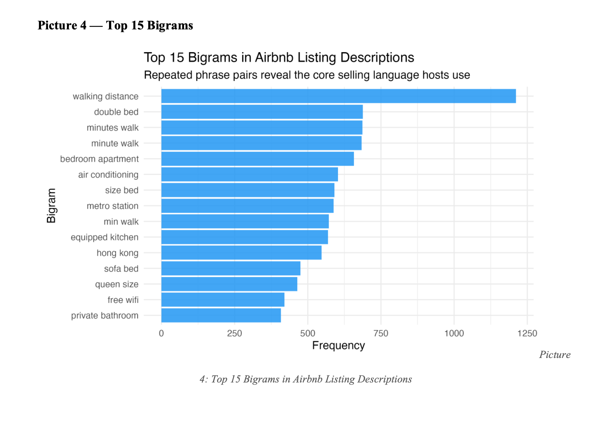
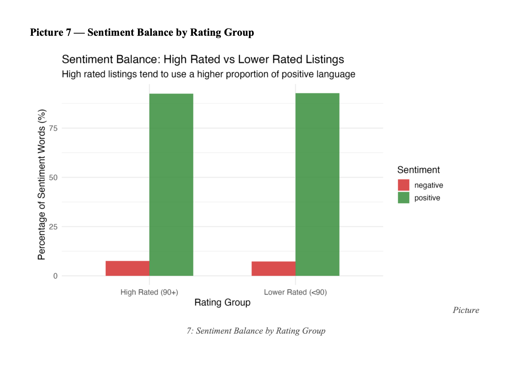
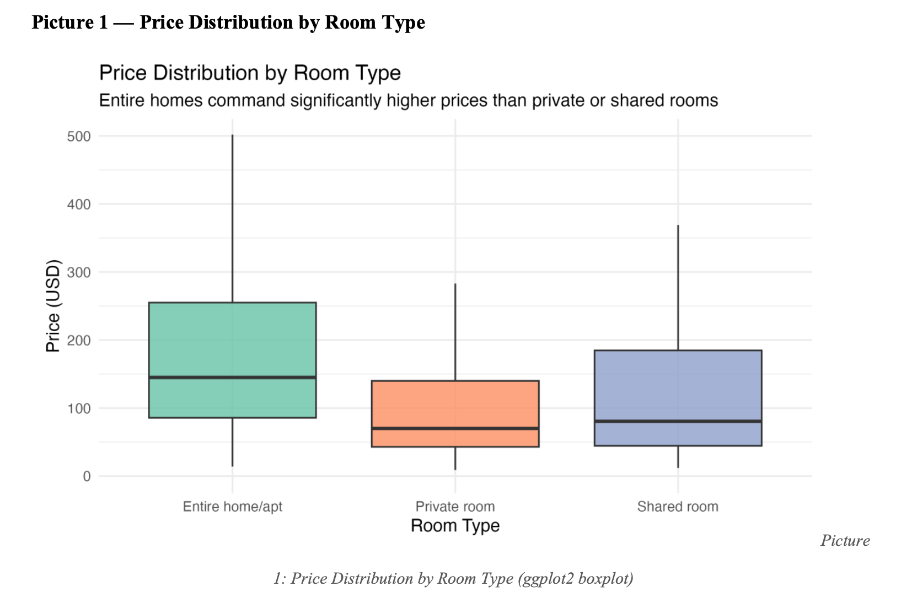
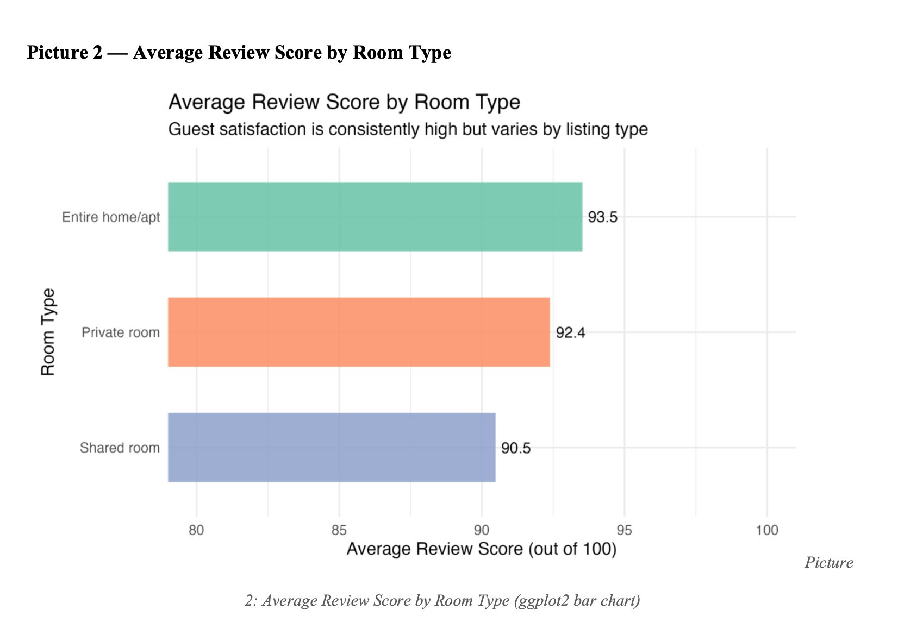
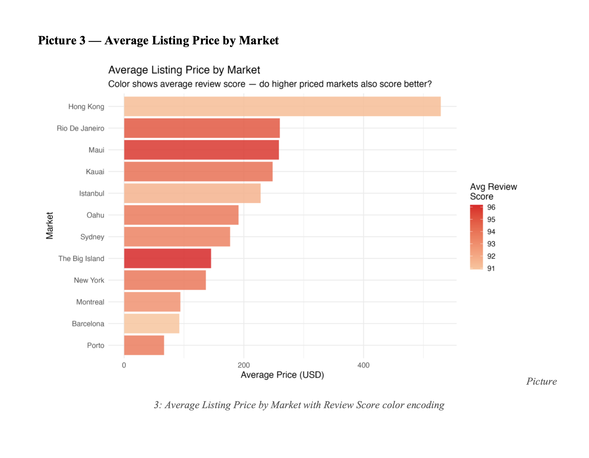
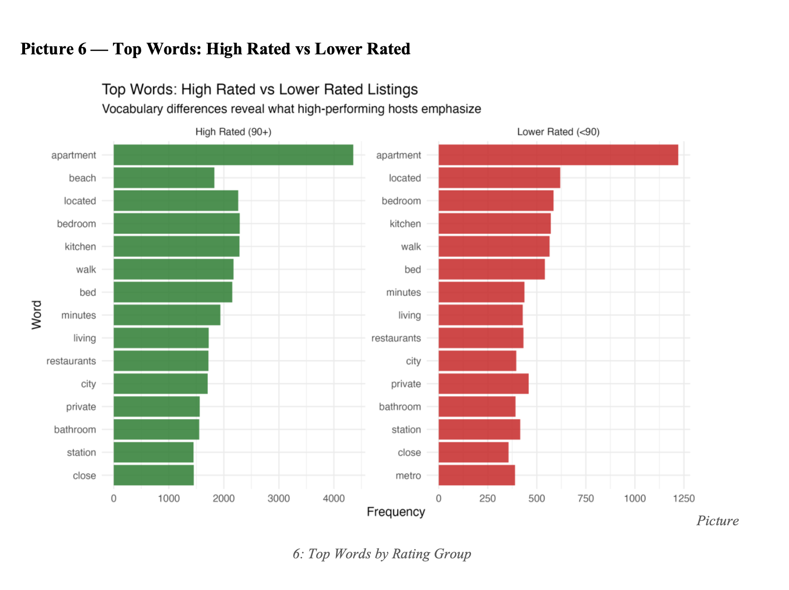
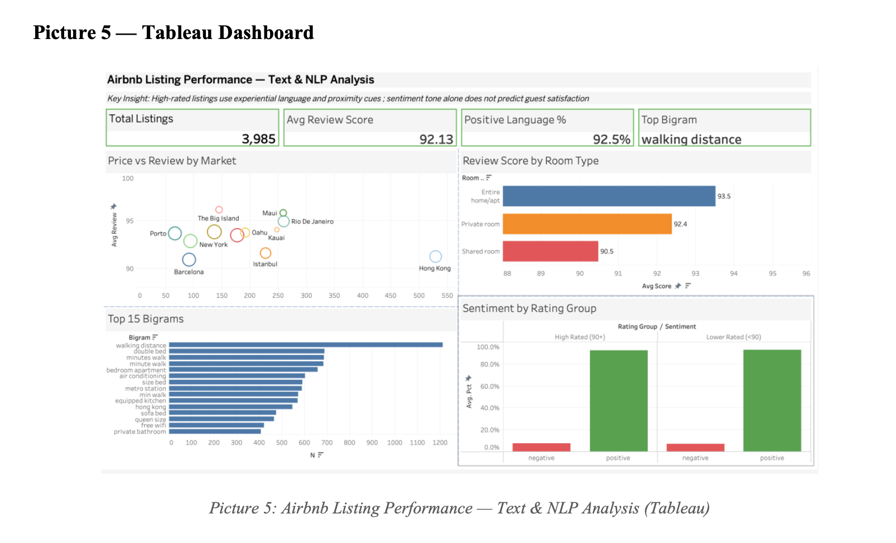

# Airbnb Listing Performance — Text Mining & NLP Analysis

## Executive Summary

This project analyzes **3,985 Airbnb listings across 12 markets** to understand what drives listing performance. Using R with `tidytext` and `ggplot2`, I applied four text mining frameworks — word frequency, bigrams, sentiment analysis, and TF-IDF — alongside numerical analysis of price and review scores.

The most actionable finding is counterintuitive: **high rated and lower rated listings use nearly identical positive language (92.5% vs 92.7%)**, meaning tone does not predict performance. Content does. Hosts who use experiential words like "beach" outperform hosts who stick to functional language like "apartment" and "kitchen," even though both groups write with equal positivity. The implication for Airbnb: coaching hosts to be more positive is wasted effort — the lever is content strategy.

## Tools Used

- **Language:** R
- **Libraries:** `mongolite`, `tidytext`, `tidyverse`, `ggplot2`, `tm`, `sentimentr`, `topicmodels`, `wordcloud`, `RColorBrewer`
- **Database:** MongoDB Atlas (`sample_airbnb.listingsAndReviews`)
- **Visualization:** ggplot2 (R) + Tableau dashboard
- **Techniques:** Tokenization, stop word removal, bigram extraction, Bing sentiment lexicon, TF-IDF weighting

## Dataset

| Metric | Value |
|---|---|
| Total listings analyzed | 3,985 |
| Markets covered | 12 |
| Average review score | 92.13 / 100 |
| Top bigram | "walking distance" (1,211 occurrences) |
| Overall sentiment | 92.6% positive |

## Four Analytical Frameworks

### 1. Word Frequency Analysis
Tokenized descriptions with `unnest_tokens()`, removed stop words with `anti_join()`. Top words: **apartment (7,816), bedroom (4,102), kitchen (4,012), bed (3,880), beach (3,183)**. Functional and spatial language dominates — but "beach" is the standout because it appears heavily in high-rated listings and barely in lower-rated ones.

### 2. Bigram Analysis
Used `unnest_tokens()` with `token = "ngrams"` and `n = 2`. The top 15 phrases fall into three predictable categories:
- **Proximity:** walking distance (1,211), minutes walk (687), metro station (588)
- **Bedroom:** double bed (688), size bed, queen size
- **Amenities:** air conditioning (603), free wifi (420), equipped kitchen

Uniform language across markets means hosts who break the template stand out significantly.

### 3. Sentiment Analysis (Bing Lexicon)
Joined tokens with `get_sentiments("bing")`. Overall: **42,353 positive words vs 3,392 negative** (92.6% positive). The critical comparison: high-rated listings are 92.5% positive; lower-rated are 92.7% positive. A 0.2 percentage point difference.

### 4. TF-IDF by Room Type
Used `bind_tf_idf()` to surface words uniquely defining each room type:
- **Entire home:** ocean, condo, unit
- **Private room:** ensuite, cozy, spare
- **Shared room:** capsule, pod, hostelworld

Expectation mismatches between language and room type likely depress review scores.

## Key Findings

### 1. Entire homes lead on both price *and* satisfaction
Entire homes: median **$150/night**, review score **93.5**. Private rooms: $75, 92.4. Shared rooms: 90.5. Higher prices do not reduce satisfaction in this segment.

### 2. Premium price does not guarantee premium experience
Hong Kong averages **$529/night** but scores only **91.2**. The Big Island scores **96.2** at just **$145/night**. Price is not a proxy for quality.

### 3. Tone does not predict performance — content does
The 0.2 percentage point gap in positive language between high and low performers is the most important finding in the project. Coaching hosts to write more positively will not improve their scores. Coaching them on *what to say* will.

## Tableau Dashboard

Four KPI cards (total listings, average review, positive language %, top bigram) plus four panels (price vs review by market, review by room type, top bigrams, sentiment by rating group).

## Recommendations

1. **Content-first host guidance.** Replace positivity coaching with content templates that include experiential cues (neighborhood character, sensory details, proximity to specific landmarks).
2. **Flag language-mismatch listings.** Hosts describing an entire home with shared-room vocabulary (or vice versa) create expectation gaps that depress reviews. TF-IDF flagging can surface these automatically.
3. **Prioritize intervention in underperforming premium markets.** Hong Kong and Barcelona have the largest price-to-satisfaction gap and represent the highest-ROI targets for quality improvement.
4. **Segment pricing tools by room type.** The $150 vs $75 median gap between entire homes and private rooms justifies separate pricing intelligence products.

